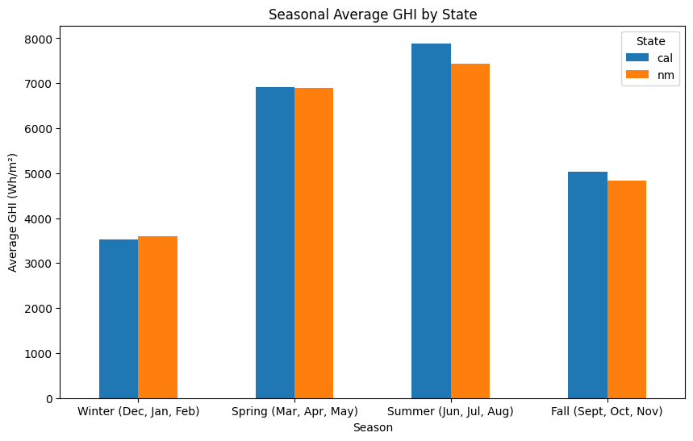
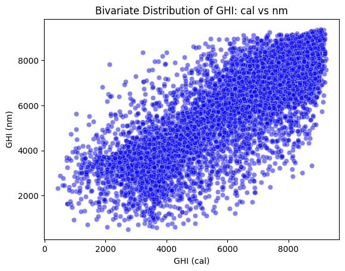
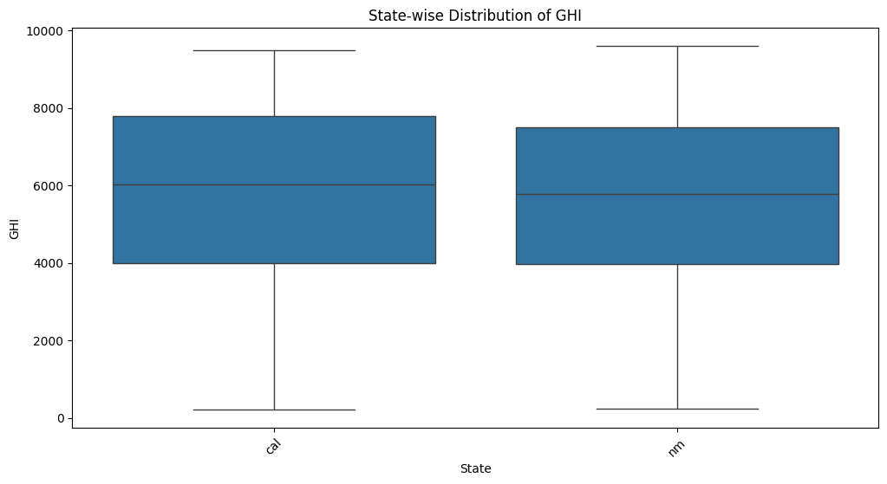
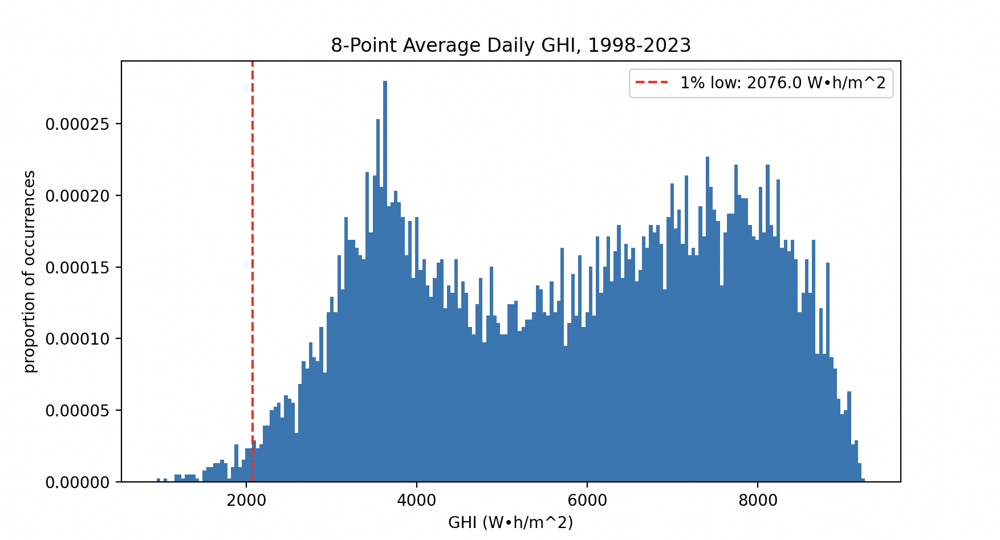

# solarCorrelations
ECE 225A project analyzing solar energy resource correlations across states.

 ## Introduction:
Low cost solar power has rapidly transformed new electricity supply in the United States.
Photovoltaics account for more than half of new generation capacity as of 2024 [CITATION]. As the
price of solar continues to go down, it is only expected to play a larger role in the future of electrical grids.

But even while solar has been a significant favorite in recent years to older generation technology, due to its renewable
nature and cheap generation, it also introduces new challenges. The most obvious problem is variabilty. The sun, while
a nearly infinite source of energy, does not always have a clear path to the panels harvesting that energy. While day-night
cycles can be accounted for with dispatchable energy storage, which has also seen a meteoric rise in the local grid,
there are also entire days where solar generation is lower than the expected amount.

If this variability was uncorrelated between different power plants, this would not be a significant issue.
But because these plants can be heavily correlated, for instance a storm system crossing over California, which could
cause low production across the entire state.

Because of this, projects that connect the grids of different regions have become more popular recently. One such example is SunZia,
a high voltage DC cable that connects New Mexico to southern California. Ideally this HVDC line would provide *independent* sources of
solar electricity to either California or New Mexico.

In this project, we want to measure the empirical independence or correlation of New Mexico and California's expected sunlight.
We will use a variety of techniques to get an understanding of the relationship between their respective solar irradiance. And we want to
categorize the benefit this could provide when an electrical grid relies mainly solar power.

The unit we will be analyzing is global horizontal irradiance (GHI) measured in Watts per meter squared. The GHI is th amount of
sunlight landing on a square meter of earth at any given time (https://pvpmc.sandia.gov/modeling-guide/1-weather-design-inputs/irradiance-insolation/global-horizontal-irradiance/). Measuring the GHI and integrating the results over one day would
give you the total solar energy that landed on the earth, per square meter, in that location. This is one of the measurements Sandia
National Laboratories uses in its PV Performance Modelling Collaborative, so it is a good proxy for solar panel performance in this paper.

 ### Dataset
Our dataset comes from the National Solar Radiation Database (NSRDB). The NSRDB uses a set of four satellites measuring various
meteorological properties in order to measure GHI, which they measure in four kilometer by four kilometer squares(https://nsrdb.nrel.gov/about/what-is-the-nsrdb).
Using this dataset, we can gather information on the GHI for any 4x4 kilometer region from 1998 to 2023. This data comes as hourly
averages for things like the GHI.

 ## Methods

Four locations in southern California, and four locations in New Mexico will first be selected. Solar irradiance in
the form global horizontal irradiance (GHI). Data from 1998 to 2023 will be gathered from all eigth locations using the NSRDB
dataset. Using the four locations, we can first get a baseline correlation beteen points within states, and also get a state average of radiation data.
Using these state averages, we can remove some local variance while still comparing statewide variance. Then we can measure the correlation
coefficient and look at how related these power sources are. On top of this, we can remove some of the annual variance that we expect by looking
at individual seasons across the ~25 years of data.

Firstly, the data needed to be converted from hourly averages for Watts per square (W/m^2) into *daily* sums of irradiance,
with units Watt-hours per meter squared (Wh/m^2). In order to do this, the hourly results just need to be summed for
every 24 hour period. Because the data is hourly and the value for each hour represents an average wattage, we know
that the energy for that hour is the same value. For this reason, we can sum the results and get daily energy per meter
squared in each location.

### Performance Measurement
Ultimately, we want to conclude whether projects like the SunZia HVDC power line are beneficial for high solar grids. In order
to do this we need to show that the correlation between these two states are sufficiently lower than the intrastate correlation.
We can also show the minimization of variance by taking the average across the 8 points and plotting those results.

We know from the Bienayme formula that if we are averaging uncorrelated random variables of equal distribution then we should expect to see
the variance is divided by the number of samples. We can use this property to measure the benefit the variance receives in our dataset
versus the ideal of uncorrelated variables. And ideally, the average across the states should be closer to showing a decrease in variance
near 1/(sample count).

Looking beyond variance and correlation, we can also measure the one-percent low solar performance, as in a grid that wants to support
itself 99% of the time with a certain amount of solar energy, the solar plants would need to be sized based on this one percent low.
We can compare the change in one percent low from first averaging the four points in each state, and then by averaging the two states
together. We can do this to look at a more realistic result of how connecting the California and New Mexico grids could help with
minimizing variance in solar generation.

## Analysis

Let's first get a look at our data, to see if we can recognize a distribution. We can graph the GHI for each day over the last
24 years to get a relatively smooth representation of daily outcomes. We can see in this first figure that the distribution does
not look to be normal, or another common distribution. While it is triangular in some ways, there is also a large spike in the 3,500 Wh/m^2 range. Because of this, we must use statistical analysis that is sound for all positive random distributions, as this data is
currently not able to be simplified.

It is tempting at first to think that we could sum together many days in an attempt to get a distribition that approximates a normal one due to the central limit theorem, however this is not an option in this case. A main purpose of this paper is to analyze the daily variation in solar resources, so the moment we start summing different days we lose the granularity that we need for strong results.

Additionally, we can also look at the seasonal average GHI by state. We can see how the GHI is affected by the time of year, where the winter and fall seasons see a lower average GHI when compared to the spring and summer seasons. We can also see that for every season except for the winter months, the california solar grid system has a higher average GHI when compared to new mexico.

We can also use the variance and covariance to measure different aspects of the data. The variances of GHI, when grouped by state,  are as follows:

INSERT STATE VARIANCES

In this case, the high variances show how variable the distribution of GHI values are around the mean, where California has a slightly higher variance than New Mexico. These values indicate how these two states experience different solar radiations throughout the year, which includes seasonal effects. This can also be seen in our previous seasonality plot, where there is a significant difference between the lower producing months (winter, fall) and the higher producing months (spring, summer).

Additionally, we can also discuss the covariance matrix, when grouped by state. The covariance between California and New Mexico GHI measures how two variables change together, where the positive correlation indicates that the GHI values for both California and New Mexico generally increase and decrease together. This is potentially due to the geographical proximity and shared climates between the two neighboring states.

Next, we will also be examining the bivariate distribution of GHI between the two states, as seen from the plot below. The X-axis shows the GHI values for California while the Y-axis shows GHI values for New Mexico.

There is a positive relationship between the GHI values of these California and New Mexico solar panels. This indicates that the higher GHI values in California are generally associated with higher GHI values in New Mexico. This is also consistent with the positive covariance seen in the data as well.

In addition, we will also include the state-wise distribution box plot of GHI values. In this plot, each box represents the distribution of GHI values for the two different states. The central line of each box shows the median GHI value while the box’s edges represent the 25th to 75th percentile, which captures the middle 50% of the data. Based on the plot, both states have a similar range of GHI values, with extremely similar values for the maximum and minimum. California’s GHI values have slightly higher variability, as the box is slightly wider, aligning with the higher variance. Through the plot, we can also see that the median values for both states are also similar with New Mexico being slightly lower than that of California.

### Averaging
We can, however, take this data gathered from eight points, four in California and four in New Mexico, and take their average. This would be equivalent to spreading generation resources out across these points. First, we can look at the results we get from each state after averaging the GHI from the four locations within.

We can see that these states have very similar value spreads, which is somewhat expected as the points in each state share latitudes with the points in the other. We do, however, have far fewer occurences of each GHI level in general because we have filtered our dataset by state and compress the four intrastate points into one.

In order to more clearly compare these sets, we can normalize this data to get distributions that will sum to 1, and tell us the probability that a random day from the dataset lands in a given bar on the histogram.
We can also measure the one percent low results for each graph.

The one percent low is significantly better when taking the four point average of each state, and comparing it to the one percent
low of all of the points. This follows with our expectation that spreading resources out over a larger area will decrease the variance
of the solar energy received.

Here we can see significant benefit again from averaging energy collection across all 8 points in this paper. The 1% low
of 2076 W•h/m^2 now represents roughly double the 1% low expected when looking at individual 4km x 4km squares. Again, the higher
1% low is an expected result of increasing the number of averaged points. We see that quadrupling the points within a state is roughly
equivalent to averaging double the points across states. In order to categorize the value of this increase, we must
move on to analyzing the variance or standard deviation.

#### Standard Deviations

Calculating the average standard deviation of each point versus the standard deviation of the average of points within each state can give us an idea of how beneficial it is
to spread out power within a state. Taking all 8 points, and looking at the standard deviation compared to the former test, can give us
an idea of how useful it is to link grids in order to increase power grid predictability.

| Location              | Average of STDs | STD of Average | Ratio | Number of Points (N) |
|-----------------------|----------------|----------------|-------|----|
| New Mexico           |2089             |1990            |1.042  | 4 |
| California           |2123             |2038            |1.050  | 4 |
| New Mexico and California |  2014      |1925            |1.046  | 2 |

We can clearly see that these variables are far from independence. In the case of Independence, the ratio
would be the square root of N. This again confirms that two points from different states minimize the variance
as much as four points spread out in the same state.

## Conclusion

Through this analysis, we have found significant correlation between all points involved in the analysis.
However, it was significantly beneficial both to spread generation out across each state, and across two states,
in order to lower variance and increase the one-percent-low performance level. From this we can say that in order
to minimize variance in solar energy supply, pursuing the distribution of generation resources within states and
across states using HVDC lines is a realistic option. Importantly, distribution across states still has a string
affect on lowering variance even after variance has been minimized through intra-state distribution.

Furthermore, as the realities of solar energy imply that both the California and New Mexico grid will already have significant
distribution within each state, it is likely that there is more to gain via connecting the California and New Mexico grid.
