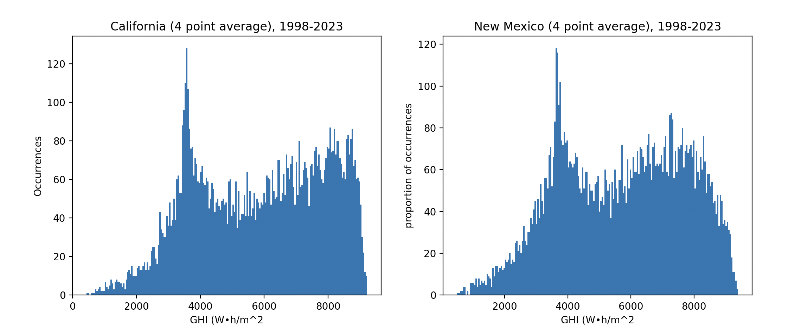

# solarCorrelations
ECE 225A project analyzing solar energy resource correlations across states.

 ## Introduction:
Low cost solar power has rapidly transformed new electricity supply in the United States.
Photovoltaics account for more than half of new generation capacity as of 2024 [CITATION]. As the
price of solar continues to go down, it is only expected to play a larger role in the future of electrical grids.

But even while solar has been a significant favorite in recent years to older generation technology, due to its renewable
nature and cheap generation, it also introduces new challenges. The most obvious problem is variabilty. The sun, while
a nearly infinite source of energy, does not always have a clear path to the panels harvesting that energy. While day-night
cycles can be accounted for with dispatchable energy storage, which has also seen a meteoric rise in the local grid,
there are also days where solar generation is lower than the expected capacity.

If this variability was uncorrelated between different power plants, this would not be a significant issue.
But because these plants can be heavily correlated, for instance a storm system crossing over California, could
cause low production across the entire state.

Because of this, projects that connect the grids of different regions have become more popular recently. One such example is SunZia,
a high voltage DC cable that connects New Mexico to southern California. Ideally this HVDC line would provide *independent* sources of
solar electricity to either California or New Mexico.

In this project, we want to measure the empirical independence or correlation of New Mexico and California's expected sunlight.
We will use a variety of techniques to get an understanding of the relationship between their respective solar irradiance. And we want to
categorize the benefit this could provide when an electrical grid relies mainly solar power.
 ### Dataset

 ## Methods

Four locations in southern California, and four locations in New Mexico will first be selected. Solar irradiance in the form of
direct normal irradiance (DNI) or global horizontal irradiance (GHI) will be used, as they closely correlate with solar panel production
(CITATION). These values can be retrieved from the National Solar Radiation Database. This database provides hourly solar radiation for
selectable locations across the United States.

Using the four locations, we can first get a baseline correlation within states, and also get a state average of radiation data.
Using these state averages, we can remove some local variance while still comparing state variance. Then we can measure the covariance,
and look at how related these power sources are. On top of this, we can remove some of the annual variance that we expect by looking
at the covariance of individual months, and also look at extreme deviations from the mean, e.g. multiple standard deviations, to see if
they are likely to be shared between states.

There are multiple other statistical analyses we will run on the dataset.

Firstly, the data needed to be converted from hourly averages for Watts per square (W/m^2) into *daily* sums of irradiance, with units Watt-hours per meter squared (Wh/m^2). In order to do this,
the hourly results just need to be summed for every 24 hour period. Because the data is hourly and the value for each hour represents an
average wattage, we know that the energy for that hour is the same value. For this reason, we can sum the results and get daily energy
per meter squared in each location.

## Analysis

Let's first get a look at our data, to see if we can recognize a distribution. We can graph the GHI for each day over the last
24 years to get a relatively smooth representation of daily outcomes. We can see in this first figure that the distribution does
not look to be normal, or another common distribution. While it is triangular in some ways, there is also a large spike in the 3,500 Wh/m^2 range. Because of this, we must use statistical analysis that is sound for all positive random distributions, as this data is
currently not able to be simplified.

It is tempting at first to think that we could sum together many days in an attempt to get a distribition that approximates a normal one due to the central limit theorem, however this is not an option in this case. A main purpose of this paper is to analyze the daily variation in solar resources, so the moment we start summing different days we lose the granularity that we need for strong results.

Additionally, we can also look at the seasonal average GHI by state. We can see how the GHI is affected by the time of year, where the winter and fall seasons see a lower average GHI when compared to the spring and summer seasons. We can also see that for every season except for the winter months, the california solar grid system has a higher average GHI when compared to new mexico. 

We can also use the variance and covariance to measure different aspects of the data. The variances of GHI, when grouped by state,  are as follows:

INSERT STATE VARIANCES 

In this case, the high variances show how variable the distribution of GHI values are around the mean, where California has a slightly higher variance than New Mexico. These values indicate how these two states experience different solar radiations throughout the year, which includes seasonal effects. This can also be seen in our previous seasonality plot, where there is a significant difference between the lower producing months (winter, fall) and the higher producing months (spring, summer).

Additionally, we can also discuss the covariance matrix, when grouped by state. The covariance between California and New Mexico GHI measures how two variables change together, where the positive correlation indicates that the GHI values for both California and New Mexico generally increase and decrease together. This is potentially due to the geographical proximity and shared climates between the two neighboring states. 

Next, we will also be examining the bivariate distribution of GHI between the two states, as seen from the plot below. The X-axis shows the GHI values for California while the Y-axis shows GHI values for New Mexico.

There is a positive relationship between the GHI values of these California and New Mexico solar panels. This indicates that the higher GHI values in California are generally associated with higher GHI values in New Mexico. This is also consistent with the positive covariance seen in the data as well.

In addition, we will also include the state-wise distribution box plot of GHI values. In this plot, each box represents the distribution of GHI values for the two different states. The central line of each box shows the median GHI value while the box’s edges represent the 25th to 75th percentile, which captures the middle 50% of the data. Based on the plot, both states have a similar range of GHI values, with extremely similar values for the maximum and minimum. California’s GHI values have slightly higher variability, as the box is slightly wider, aligning with the higher variance. Through the plot, we can also see that the median values for both states are also similar with New Mexico being slightly lower than that of California. 

We can, however, take this data gathered from eight points, four in California and four in New Mexico, and take their average. This would be equivalent to spreading generation resources out across these points. First, we can look at the results we get from each state after averaging the GHI from the four locations within.

We can see that these states have very similar value spreads, which is somewhat expected as the points in each state share latitudes with the points in the other. We do, however, have far fewer occurences of each GHI level in general because we have filtered our dataset by state and compress the four intrastate points into one. In order to more clearly compare these sets, ee can normalize this data to get distributions that will sum to 1, and tell us the probability that a random day from the dataset lands in a given bar on the histogram.

